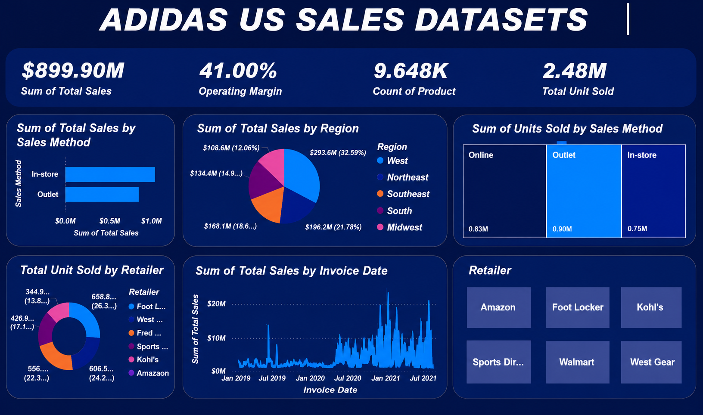

# Adidas US Sales Performance Dashboard

An interactive Power BI dashboard analyzing Adidas' US sales performance across regions, retailers, and sales channels. Built as a single-page visual summary translating raw sales transaction data into actionable business insights.

## 🔗 Overview

| | |
|---|---|
| **Tool** | Microsoft Power BI (Cards, Bar Charts, Pie Charts, Line Charts, Donut Charts) |
| **Data** | Adidas US sales dataset — Region, Retailer, Sales Method, Invoice Date, Units Sold, Total Sales |
| **Scope** | 9,648 products, 6 retailers, 5 regions, Jan 2019 – Jul 2021 |

## 🎯 Objectives

- Deliver a single-page visual summary translating raw sales rows into top-line KPIs
- Compare sales performance across regions and sales methods
- Track how units sold break down by channel (Online, Outlet, In-store)
- Surface which retailers and time periods drive the most revenue

## 📊 Dashboard Components

- **KPI Header Row** — Sum of Total Sales, Operating Margin, Count of Product, Total Unit Sold
- **Sum of Total Sales by Sales Method** — bar chart comparing In-store vs. Outlet sales
- **Sum of Total Sales by Region** — pie chart across West, Northeast, Southeast, South, and Midwest
- **Sum of Units Sold by Sales Method** — column comparison of Online, Outlet, and In-store unit volume
- **Total Unit Sold by Retailer** — donut chart across Foot Locker, West Gear, Sports Direct, Kohl's, Amazon, and others
- **Sum of Total Sales by Invoice Date** — line chart tracking sales trend from Jan 2019 to Jul 2021
- **Retailer Panel** — Amazon, Foot Locker, Kohl's, Sports Direct, Walmart, West Gear as interactive filter tiles

## 🛠️ Process & Problem-Solving

- **Channel comparison clarity** — sales method figures alone didn't show the full picture, so units sold were broken out separately by channel (Online 0.83M, Outlet 0.90M, In-store 0.75M) to give a volume view alongside the revenue view.
- **Regional skew** — total sales by region needed to show both dollar value and share, so each slice was labeled with both figures (e.g. $293.6M / 32.59% for Midwest) instead of relying on the legend alone.
- **Retailer overload** — with six major retailers in the data, a flat list would clutter the page, so retailers were surfaced as compact filter tiles that double as visual navigation.
- **Trend readability** — daily invoice-level data was noisy at a glance, so the sales-by-date view was kept as a continuous line to make seasonal spikes and dips visible over the full 2019–2021 range.

## 💡 Key Insight

The **Midwest (32.59%)** and **Southeast (21.78%)** regions together account for over half of total sales, while **Outlet** is the strongest sales method by both revenue and units sold — suggesting outlet-driven regional expansion is where Adidas' US sales are currently concentrated.

## 📈 Results

- Top-line KPIs: **$899.90M Total Sales**, **41.00% Operating Margin**, **9.648K Products**, **2.48M Units Sold**
- **Outlet** leads all sales methods, both in revenue and in units sold (0.90M)
- **Midwest** is the top-performing region by total sales ($293.6M, 32.59%)
- Sales show clear seasonal spikes, particularly around mid-year periods, across the 2019–2021 window

## 🧰 Skills Demonstrated

- Power BI dashboard design (Cards, Charts, Slicers, interactive filtering)
- Data modeling and DAX measures for KPI calculation
- Translating raw transaction data into a clear, percentage-based narrative
- Visual hierarchy and dashboard layout for non-technical audiences

## 📁 Repo Contents

- `PowerBI.png` — screenshot of the finished dashboard
- `README.md` — this file

## 👤 Author

Ajayi Oluwatimilehin Benjamin
[LinkedIn](https://linkedin.com/in/benaj619) · [Portfolio](https://benaj619.my.canva.site) · benaj619@gmail.com
